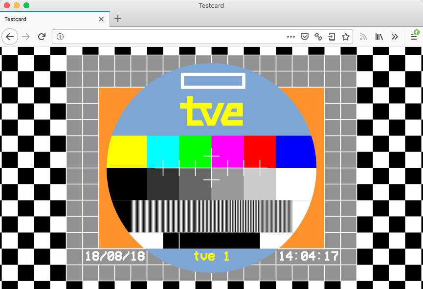

# About

This is a remake of the custom PM5544 test card that the Spanish national
television broadcaster RTVE used since the late 70s until the late 90s, using
SVG and other modern technologies.

I did this entirely using SVG because I wanted to try advanced SVG stuff such
as clipping paths, masks, gradients, patterns and other defs. I find hand
crafted SVG to be easier to use than what it looks.

The test pattern was manually crafted by imitating the look of original images.
When viewed in a web browser, some JS code will attempt to add a clock with the
current date and time.

# Demo

Here is a [live demo](https://danirod.github.io/rtve-testcard/) you can test on your web browser. This is how it looks on Firefox.

It should work on other browsers as long as they have good support for SVG. Safari 12 supports all the SVG features in use. Older versions of Safari won't display properly the sinusoidal bars (the black and white stripes below the grayscale gradient).

# References

* <https://en.wikipedia.org/wiki/Philips_PM5544>
* <http://www.rtve.es/rtve/20140611/sobre-nosotros-imagen-corporativa-historia/952622.shtml>
* <https://www.youtube.com/watch?v=wPGzSpB90oE>
